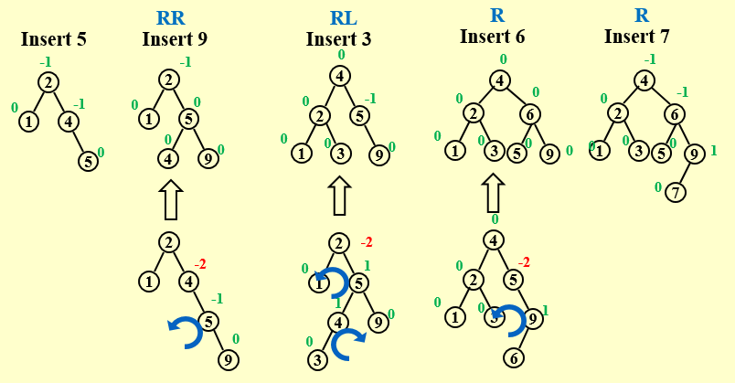
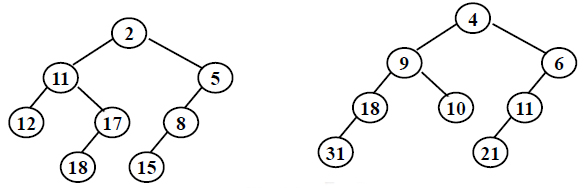

# Advanced Data Structure and Algorithm Analysis
## Prolegomenon
### Grading Policies
**Homework(10)**
**Discussions or quiz(10)**
**Research Project(30)**
>done in groups of 3
choose 2 out of 7
Report(20+20)/2 points
In-class presentation(10~15minutes,10 points)
The speaker will be chosen randomly
E-mail to sign up for presentation
Bonus 

**MidTerm(10)**
**Final Exam(40)**
>You can replace the MidTerm by a higher grade in Final Exam 

* E-mail denghaoran@zju.edu.cn before 6th March to send your group.

## AVL Trees,Splay Trees and Amortized Analysis

### AVL Tree 

#### Target
speed up searching(with insertion and deletion)

**Recall**:To solve this problem,the time complexity is:
* Array: $O(N)$ (Search) ; $O(1)$ (Insert)
* Sorted Array: $O(logN)$ (Search) ; $O(N)$ (Insert, because we need to move the elements after the insertion point)
* Binary Sorted Tree: $O(height)$ (Search); $O(height)$(Insert)  
However ,in the worst case ,the $O(height)$ is $O(N)$

#### Optimize:Balanced Tree


#### Definition
**Balanced Tree**
An empty binary tree is height balanced.  If $T$ is a nonempty binary tree with $T_L$ and $T_R$ as its left and right subtrees, then $T$ is height balanced iff
1. $T_L$ and $T_R$ are height balanced
2. $|h_L-h_R|\leq1$ where $h_L$ and $h_R$ are the heights of $T_L$ and $T_L$ , respectively.


**Balance Factor(BF)**
The Balance Factor(BF) of a node=$h_L-h_R$ .
 In an AVL Tree ,$BF(node)=-1,0,or 1$.

The BF of an empty tree is 0.

#### Tree Roation
1. **Tree Rotation** is an operation on a binary tree that changes the suructure without interfering with the order of elements.


2. After a rotation,the side of rotation increase its height by 1 whilst the side opposite the rotation decreases its height similarly.

**pseudo code of Left Rotation**

```
Tree Temp = A->Left
A->Left = B
B->Right = Temp
```
3. The time complexity is $O(1)$.

#### Insertion of an AVL Tree
##### RR Rotation

**RR Rotation:**
In General:

**Note:** 
A is **NOT** necessarily thr root of the tree.**A is the first Node that has a wrong BF after the insertion**.
**The insertion** could be just happened in the right subtree of B **but NOT necessarliy be the right child of B**.

##### LL Rotation

**Mind the NOTE!**
In General:


##### LR Rotation

In General:


##### RL Rotation

In General:


**注意：**
单旋转(Single Rotation)发生在要插入的值**不在**关键边(连接BF值产生异常的点和其相邻点的边)**之间**。


图中虚线的边即为关键边，图中待插入的13不在关键边的4 ~ 7之间；12不在关键边13 ~ 14之间。
双旋转(Double Rotation)发生在要插入的值**在**关键边的值**之间**，并分为RL旋转与LR旋转。
旋转时$k_2$成为最后的根节点，$k_2$左子树给$k_1$作为右子树，$k_2$右子树给$k_3$作为左子树。$k_1$、$k_3$分别作为$k_2$的左右子树。

图中BF值出现异常的点为$k_1$，与其相连的点为$k_3$，判断是LR旋转还是RL旋转的点为$k_2$。

##### Reference
> Read the declaration and functions in [1] Figures 4.42 – 4.48

#### Algorithm Analysis
$n_h$=$F_n$-$1$ where $F_n$ is the $n$th Fibonacci number, $n_h$ is the minimum number of nodes in an AVL tree of height $h$.
$n_h$->$((1+\sqrt{5})/2)^h$
$h$->$O(ln(N))$

### Splay Tree
#### Target
Any $M$ consecutive tree opertaions starting from an empty tree take at most $O(M log N)$ time.
#### Insertion of a Splay Tree
X:a Node that is NOT root
P:parent of X
G:grandParent of X
Spaly Tree:每次对一个节点进行操作（访问，删除）后，都将该节点递归地旋转到根节点。
##### Case1:P is the root
Rotate X and P
##### Case2:P is not the root
###### Zig-zag:Double Rotation


###### Zig-zig:Single Rotation

##### Reference
> Read the 32-node example given in Figures 4.52 – 4.60

**Note**
四种旋转情况的总结（适用于选择题画图）
其中①②表示操作的顺序


#### Deletion of a Splay Tree
1. Find(X) *The Node X will be at root.*
2. Remove(X) *There will be two subtrees $T_L$ and $T_R$.*
3. FindMax($T_L$) *The Largest element will be the root of $T_L$, and has NO right child.*

### Appendix：Implementation in C(AVL Tree,Splay Tree)
详见`Project1.c`
其中，AVL Tree的删除与普通二叉搜索树相同，为`Delete()`函数。
Splay Tree相关部分需要先初始化`NullNode`变量。

### Amortized Analysis(均摊分析)

#### Recall
**The target of a Splay Tree:** Any $M$ consecutive tree opertaions starting from an empty tree take at most $O(M log N)$ time.
--**Amortized time bound**

#### Aggregate analysis(聚合分析)
**Idea**
Show that for all n, a sequence of n operations takes worst-case time T(n) in total. In the worst case, the average cost, or amortized cost, per operation is therefore $T(n)/n$.

【**Example**】Stack with `MultiPop(int k,Stack S)`
```C
Algorithm  {
    while ( !IsEmpty(S) && k>0 ) {
        Pop(S);
        k - -;
    } /* end while-loop */ 
}
```
Consider a sequence of n `Push`,`Pop`,and `MultiPop` operations on an initially empty stack.
Because we can pop each object from the stack at most once for each time we have pushed it onto the stack.
$sizeof(S) \leq n$
$T_{amortized}= O( n )/n = O(1)$

#### Accounting method(信用方法)
**Idea**
When an operation’s amortized cost exceeds its actual cost, we assign the difference to specific objects in the data structure as credit. Credit can help pay for later operations whose amortized cost is less than their actual cost.
**Note** 
For all sequences of n operations, we must have:


【**Example**】Stack with `MultiPop(int k,Stack S)`
```C
    while ( !IsEmpty(S) && k>0 ) {
        Pop(S);
        k - -;
    } /* end while-loop */ 
}
```
Consider a sequence of n `Push`,`Pop`,and `MultiPop` operations on an initially empty stack.

#### Potential method(势能方法)
**Idea**
Take a closer look at the credit.
为了避免给每一种操作都设计一个均摊代价，我们设计一个势能函数来统一化设计均摊代价。

In general, a good potential function should always **assume its minimum** at the start of the sequence.
【**Example0**】Stack with `MultiPop(int k,Stack S)`
```C
    while ( !IsEmpty(S) && k>0 ) {
        Pop(S);
        k - -;
    } /* end while-loop */ 
}
```

【**Example1**】  Splay Trees: $T_{amortized}$ = $O( log N )$
$\Phi(T)=\Sigma_{i \in T} ln(S(i))$
$S(i)$:以`x`为根的子树中的节点个数。也叫做子树的质。


**Appendix:Math**
If $a + b ≤ c$, and a and b are both positive integers, then:
$log{a} + log{b} ≤ 2 log{c} - 2$
**Proof:**
By the arithmetic-geometric mean inequality,
$(ab)^{1/2} ≤ (a+b)/2$
Thus
$(ab)^{1/2} ≤ c/2$
Squaring both sides gives
$ab ≤ c^2/4$
Taking logarithms of both sides proves the lemma.

其中，`Zig-zag`和`Zig-zig`都是双旋转，开销为2。
**`Zig-zag`中**：
$R_2(X)$和$R_1(G)$都是整棵树的质，故相互抵消。$R_1(P)<R_1(X)$,故放缩。
**`Zig-zig`中**：
$R_1(X)+R_2(G) \le 2R_2(X)-2$
$2+R_2(X)-R_1(X)+R_2(P)-R_1(P)+R_2(G)-R_2(G) \le 2R_2(X) -2 R_1(X) +R_2(P)-R_1(P) \le 3(R_2(X) - R_1(X))$

### Exercises
#### Choose the correct answer
1. If the depth of an AVL tree is 6 (the depth of an empty tree is defined to be -1), then the minimum possible number of nodes in this tree is:
A.13
B.17
C.20
D.33
> **Answer**: D
>  $n_h$ = $n_{h-1} +n_{h-2} + 1$
又 $depth = height - 1$
故$n_{depth=6}$ = $n_7$ = 33
2. Insert 2, 1, 4, 5, 9, 3, 6, 7 into an initially empty AVL tree. Which one of the following statements is FALSE? (1分)
A. 4 is the root
B. 2 and 6 are siblings
C. 3 and 7 are siblings
D. 9 is the parent of 7
> **Answer**: C The following figure shows the AVL tree after inserting.
> 
3. For the result of accessing the keys 3, 9, 1, 5 in order in the splay tree in the following figure, which one of the following statements is FALSE? (1分)

A. 5 is the root
B. 1 and 9 are siblings
C. 6 and 10 are siblings
D. 3 is the parent of 4
> **Answer**: D


## Red-Black Trees and B+ Trees

### Red-Black Trees

#### Target 
Balanced binary seach tree using a key called *color*.

#### Definition
**Red-Black Tree**
红黑树是一种含有红黑结点并能自平衡的二叉查找树。它必须满足下面性质：

* 性质1：每个节点要么是黑色，要么是红色。
* 性质2：**根**节点是**黑色**。
* 性质3：每个**叶子**节点（NIL）是**黑色**。(所有叶子节点**都是哨兵**，哨兵都是**黑色**的)
* 性质4：每个**红色**结点的两个子结点一定都是**黑色**。
* 性质5：任意一结点到每个叶子结点的**简单路径**都包含**数量相同**的**黑**结点。

**性质3**存在的意义：
为了保证不存在奇怪的红黑树，所有**孩子为空的节点**都必须是**哨兵**，是**黑色**的，这样极度不平衡的树会**不满足**性质5。

**black-height**
The black-height of any node x,denoted by `bh(x)`,is the number of **black** nodes on any simple path from x(**x not included**) down to a leaf.`bh(Tree)=bh(root)`.

【**Lemma**】
A red-black tree with N internal nodes has height at most $2ln(N +1)$.

**Proof**：

**Lemma1:** For any node x, $sizeof(x) \geq 2^{bh(x)} – 1$. 
If $h(x) = 0$, x is `NULL` -> $sizeof(x) = 2^0 – 1 = 0$
Suppose it is true for all x with $h(x) \leq k$.
For x with $h(x) = k + 1$, $bh(child) = bh(x) \space or \space bh(x) – 1 $
Since $h(child) \leq k$, $sizeof(child) \geq 2^{bh(child)} – 1 \geq 2^{bh(x) – 1} – 1$
Hence $sizeof(x) = 1 + 2sizeof(child) \geq 2^{bh(x)} – 1$

**Lemma2:** $bh(Tree) \geq h(Tree) / 2$  
Since for every red node, both of its children must be black, hence on any simple path from *root* to a leaf, at least half the nodes (*root* not included) must be black.
$Sizeof(root) = N \geq 2^{bh(Tree)} – 1 \geq 2^{h/2} – 1$

由**Lemma1**和**Lemma2**可以得到**Lemma**的结论。

#### Insert
由于贸然插入黑色节点很有可能会导致性质5出现问题，故我们尽量插入**红色**节点。
综合考虑五条性质，插入**红色**节点时，**只有性质2**和**性质4**有可能会被破坏。
##### Case 1

此时插入的红色节点`z`依然可能破坏性质2或者4，故作迭**代处理**。
定义`z`, `z.p`, `y`, `z’`
循环终止条件：**为了保证满足性质4**。
自底向上修正树，z的子树都满足红黑性质
结束后把根节点染成黑色
循环过程中，如果`z`变为根节点，则(2)被破坏，(4)被保留；否则`z.p`及其祖先的颜色不会改变，(2)被保留，如果`z.p`为红色则(4)被破坏。性质4**只可能**在`z`和`z.p`之间被破坏
循环开始前，如果`z.p`是根，则红黑树性质决定`z.p`为黑色，循环调整之前不会改变`z.p`的颜色
循环结束后，`z.p`是黑色的（如果`z`为根节点那么其父节点哨兵结点也是黑色的），性质(4)不会被破坏，只有可能性质(2)被破坏，所以对根节点进行染色
还有三项对称情况。

##### Case 2 & Case 3

case 2、3**不需要**迭代。
对于case2、3来说，红黑树插入操作**循环总数不超过2**，因为case2、3一旦被执行就结束了。

##### Algorithm Analysis
总的来说，红黑树的插入操作中，我们有：
$T = O( h ) = O( lnN )$

#### Delete
When we do deletions,we must add 1 blcak to the path of the replacing node.
If the node is red,we can delete it directly because it has no influence on th red-black tree.
* Delete a leaf node :  Reset its parent link to NIL.(only if the node is black originally)
* Delete a degree 1 node :  Replace the node by its single child.
* Delete a degree 2 node :
  1. Replace the node by the largest one in its left subtree or the smallest one in its right subtree.(keep the color)
  2. Delete the replacing node from the subtree.

**登场人物**：4个Case

分别操作(Case 1 见上图)

兄弟红易兄弟黑，换色单旋接着推；
侄黑父红换兄色，父侄双黑染红兄，上推；
近侄红来远侄黑，旋转能把模样改；
远侄红来单旋转，父兄换色侄变黑。

### B+ Trees

#### Definition
A B+ tree of order M is a tree with the following structural properties:
*  The root is either a leaf or has between 2 and M children.
*  All nonleaf nodes (except the root) have between $\lceil M/2 \rceil$ and $M$ children.
*  All leaves are at the same depth.

Assume each nonroot leaf also has between $\lceil M/2 \rceil$ and $M$ children.

#### Find
```C
Btree Find ( ElementType X, Btree T ) 
{ 
    Search from root to leaf for X and find the proper leaf node;
    if ( X is in this node ) 
    		return this node;
    else
    		return NULL;
}
```

#### Insert
```C
Btree  Insert ( ElementType X,  Btree T ) 
{ 
	Search from root to leaf for X and find the proper leaf node;
	Insert X;
	while ( this node has M+1 keys ) {
    		split it into 2 nodes with [(M+1)/2 ]  and [(M+1)/2 ] keys, respectively;
    		if (this node is the root)
        		create a new root with two children;
    		check its parent;
	}
}
```
### Exercise
#### Choose the correct answer
1. In the red-black tree that results after successively inserting the keys 41; 38; 31; 12; 19; 8 into an initially empty red-black tree, which one of the following statements is FALSE?
A.38 is the root
B.19 and 41 are siblings, and they are both red
C.12 and 31 are siblings, and they are both black
D.8 is red
> **Answer: B** 把红黑树看作B+树，同一节点左右值为红色，不同层连接节点为黑色。19和41不是兄弟节点，因为他们不在同一层。
> 

2. After deleting 15 from the red-black tree given in the figure, which one of the following statements must be FALSE?

A.11 is the parent of 17, and 11 is black
B.17 is the parent of 11, and 11 is red
C.11 is the parent of 17, and 11 is red
D.17 is the parent of 11, and 17 is black
> **Answer: C**
> 删除节点时，如果删除的是中间节点，用左子树最大值或者右子树最小值替换，递归直到叶子节点，然后删除叶子节点。
> 
3. Insert 3, 1, 4, 5, 9, 2, 6, 8, 7, 0 into an initially empty 2-3 tree (with splitting). Which one of the following statements is FALSE?
A.7 and 8 are in the same node
B.the parent of the node containing 5 has 3 children
C.the first key stored in the root is 6
D.there are 5 leaf nodes
> **Answer: A**
> 

4. After deleting 9 from the 2-3 tree given in the figure, which one of the following statements is FALSE?
A.the root is full
B.the second key stored in the root is 6
C.6 and 8 are in the same node
D.6 and 5 are in the same node
> **Answer: D**
> 

5. Which of the following statements concerning a B+ tree of order M is TRUE?
A.the root always has between $2$ and $M$ children
B.not all leaves are at the same depth
C.leaves and nonleaf nodes have some key values in comon
D.all nonleaf nodes have between $⌈M/2⌉$ and $M$ children
> **Answer: D**
> A.根节点不一定有$2$到$M$个孩子，因为根节点可能是叶子节点。
> B.所有叶子节点都在同一层。
> C.叶子节点和非叶子节点没有共同的key值，因为叶子节点不存储key值。
> D.非叶子节点的孩子数在$⌈M/2⌉$和$M$之间。


## 重要：AVL树、splay树(伸展树)和红黑树比较
**一、AVL树：**

优点：查找、插入和删除，最坏复杂度均为$O(logN)$。实现操作简单
>如过是随机插入或者删除，其理论上可以得到$O(logN)$的复杂度，但是实际情况大多不是随机的。如果是随机的，则AVL树能够达到比红黑树更优的结果，因为AVL树的高度更低。如果只进行插入和查找，则AVL树是优于红黑树的，因为红黑树更多的优势还是在删除动作上。

缺点：
1. 借助高度或平衡因子，为此需要改造元素结构，或额外封装-->伸展树可以避免。
2. 实测复杂度与理论复杂度上有差距。插入、删除后的旋转成本不菲。删除操作后，最多旋转$O(logN)$次，(Knuth证明，平均最坏情况下概率为0.21次)，若频繁进行插入/删除操作，得不偿失。
3. 单次动态调整后，全树拓扑结构的变化量可达$O(logN)$次。-->红黑树为$O(1)$

**二、伸展树(splay tree)**

优点：
1. 无需记录节点高度和平衡因子，编程实现简单易行
2. 分摊复杂度为$O(logN)$
3. 局部性强，缓存命中率极高时，效率甚至可以更高。

注：伸展树是根据数据访问的局部性而来的主要是：
1. 刚刚被访问的节点，极有可能在不久之后再次被访问到
2. 将被访问的下一个节点，极有可能就处于不久之前被访问过的某个节点的附近。

缺点：
1. 仍不能保证单次最坏情况的出现，不适用效率敏感的场合
2. 复杂度分析比较复杂

**三、红黑树**
优点:
1. 所有的插入、删除、查找操作的复杂度都是$O(logN)$
2. 插入操作能够在最多2次旋转后达到平衡状态，而删除操作更是能够在一次旋转后达到平衡状态。删除操作有可能导致递归的双黑修正，但是在旋转之前，只是染色而树的结构没有任何实质性的改变，因此速度优于AVL树。
3. 红黑树可以保证在每次插入或删除操作之后的重平衡过程中，全书拓扑结构的更新仅涉及常数个节点。尽管最坏情况下需对$O(logN)$个节点重染色，但就分摊意义而言，仅为$O(1)$个。

缺点：左右子树高度相差比AVL树大。

## 总结：AVL树、splay树(伸展树)和红黑树比较
树 | 插入 | 删除 | 查找 | 空间 |
---|---|---|---|---|
AVL树 | $O(logN)$ | $O(logN)$ | $O(logN)$ | $O(N)$ |
伸展树 | $O(logN)$ | $O(logN)$ | $O(logN)$ | $O(N)$ |
红黑树 | $O(logN)$ | $O(logN)$ | $O(logN)$ | $O(N)$ |
（均摊下红黑树插入、删除为$O(1)$）


## Inverted File Index

### Inverted File Index

#### Definition
**Index** is a mechanism for locating a given term in a text.
**Inverted file** contains a list of pointers(e.g. the number of a page) to all occurrences of that term in the text.

简单来说，inverted是因为它是根据term来索引的，而不是根据文档来索引的。也就是说用词找文档，而不是用文档找词。
为了更快的找到匹配项，我们先考虑频率低的词，因为它们的文档数目更少，所以我们可以先在这些词中找到匹配项，然后再在这些文档中找到匹配项。
#### Index Generateor
```c++
while ( read a document D ) {
    while ( read a term T in D ) {
        if ( Find( Dictionary, T ) == false )
            Insert( Dictionary, T );
        Get T’s posting list;
        Insert a node to T’s posting list;
    }
}
Write the inverted index to disk;
```
#### Distributed indexing 
Each node contains index of a subset of collection

第二种相对更好，因为第一种划分法，如果1号服务器挂了，那么所有涉及A~C的搜索都将无法继续。
#### Dynamic indexing
Docs come in over time
* postings updates for terms already in dictionary
* new terms added to dictionary

Docs get deleted
创建一个临时性辅助index，每次更新在辅助index中，搜索时再合并到主index中。

#### Index Compression
* 删除不必要的词汇如a,the等再建立索引。
* 每次都记录与上一次出现的距离，而不是绝对位置，这样可以节省空间（否则很长的表导致绝对位置很大）。

#### Word Stemming
* 词干提取：将单词的词缀去掉，只保留词根。如：running -> run
* Process a word so that only its stem or root form is left. 

#### Stop Words
* 一些常用词，如a,the等，可以不用索引，因为它们出现的频率太高，而且它们的出现并不能帮助我们找到更好的匹配项。
* Some words are so common that almost every document contains them, such as “a” “the” “it”.  It is useless to index them.  They are called stop words.  We can eliminate them from the original documents.


#### Thresholding 阈值
* Document: only retrieve the top x documents where the documents are ranked by weight
* Query: Sort the query terms by their frequency in ascending order; search according to only some percentage of the original query terms.The world has a **low frequency** in the query, so it is **more important** to the query.
相当于把搜索范围缩小了，但是搜索结果的质量也会下降，所以这个阈值要合理设置。

### Measuring the Performance of an Index
**Data Retrieval** Performance Evaluation (after establishing correctness)
* Response time
* Index space

**Information Retrieval** Performance Evaluation
* How relevant is the answer set?

#### Relevance(only for imformation retrieval)
Relevance measurement requires 3 elements:
1. A benchmark document collection
2. A benchmark suite of queries
3. A binary assessment of either Relevant or Irrelevant for each query-doc pair

#### Precision and Recall

**Precision:** the percentage of the retrieved documents that are relevant
**Recall:** the percentage of the relevant documents that are retrieved
$Precision = \frac{Retrieved \ and \ Relevant}{Retrieved}$
$Recall = \frac{Retrieved \ and \ Relevant}{Relevant}$


### Exercise
#### Judge the following statements
1. While accessing a term, hashing is faster than search trees.
> True
> 可以通过搜索树、哈希表的方式来存储和访问term，而哈希表花费的是常数时间，所以访问更快。当然，哈希表存在存储不灵活等问题。
2. In distributed indexing, document-partitioned strategy is to store on each node all the documents that contain the terms in a certain range.
> False
> 考分布式索引，以文件为分割的索引将文件号为一个范围内的文件存在一个节点上。
3. When evaluating the performance of data retrieval, it is important to measure the relevancy of the answer set.
> False
> 这里要注意，表现分为 data retrieval 和 information retrieval，要注意两者的区分。前者的标准是**response time 与 index file space**，后者才是**relevancy of the answer set**。
4. Precision is more important than recall when evaluating the explosive detection in airport security.
> False
> Both important.
#### Choose the correct answer
1. When measuring the relevancy of the answer set, if the precision is high but the recall is low, it means that: 
A. most of the relevant documents are retrieved, but too many irrelevant documents are returned as well
B. most of the retrieved documents are relevant, but still a lot of relevant documents are missed
C. most of the relevant documents are retrieved, but the benchmark set is not large enough
D. most of the retrieved documents are relevant, but the benchmark set is not large enough
> **Answer: B**
> 精确度高而回收率低，说明搜索到的文件中不相关文件少，但是仍有大量相关文件没有搜索到。
2. Which of the following is NOT concerned for measuring a search engine?
A. How fast does it index
B. How fast does it search
C. How friendly is the interface
D. How relevant is the answer set
> **Answer: C**
> 衡量搜索引擎的指标主要是：建立索引的速度、搜索速度、对查询语句的处理。
3. There are 28000 documents in the database. The statistic data for one query are shown in the following table. The recall is: __

| | Relevant | Irrelevant |
| ---- | ---- | ---- |
|Retrieved|4000|12000|
|Not Retrieved|8000|4000|
A.14%
B.25%
C.33%
D.50%
> **Answer: C**
> $Recall=\frac {Retrieved \space and \space Relevant}  {Relevant}=4000/(4000+8000)=33\% $

## Leftist Heaps and Skew Heaps

### Leftist Heap

#### Recall 
**Heap:** Structure Property + Order Property
结构性质：
* 堆是完全二叉树
* 堆的每一个子树都是堆

顺序性质：
* 堆的每一个孩子都比自己大（小）

堆的操作：
* percolate up & percolate down
  
堆的合并：
* 开销为$O(N)$，线性的把两个堆中的元素逐一插入。我们现在就要加速这一过程。

#### Leftist Heap
**Structure Property**:
* a binary tree,but **unbalanced**

**Order Property**:
* the same as normal heap

#### Definiition

##### NPL,The null path length
The null path length,$Npl(x)$,of any node $X$ is the length of the **shortest path** from $X$ to a node **without two childeren**. Define Npl(NULL)=-1.
**Note:**
$Npl(x)=min\{Npl(c)+1\}$ , for all c as children of x

##### Leftist Heap
The leftist heap property is that for every node x in the heap,the null path length of the left child is **at least as large as**  ($\geq $) that of the right child.
这个过程就要求左倾堆的左子树（起码看起来）要比右子树长，至少不会太短。

**Example:**


**【Theorem】**：
A leftist tree with $r$ nodes **on the right path** must have at least $2^r-1$ nodes.

So we can find that the **length of the right path** of a leftist tree with $N$ nodes is $\lfloor log{(N+1)}\rfloor$

#### Merge Operation Recursive


1. 比较需要合并的两棵树树根节点谁更小，大的与小的右子树合并
2. 递归方法合并根节点小的右子树和根节点大的整棵树。
3. 比较新树的左右子树哪一个的$Npl$更大，若右边更大则交换左右子树。


##### Declaration
```C
struct TreeNode 
{ 
	ElementType Element;
	PriorityQueue Left;
	PriorityQueue Right;
	int Npl;
} ;
```

##### Implementation
```C
PriorityQueue  Merge ( PriorityQueue H1, PriorityQueue H2 )
{ 
	if ( H1 == NULL )   return H2;	
	if ( H2 == NULL )   return H1;	
	if ( H1->Element < H2->Element )  return Merge1( H1, H2 );
	else return Merge1( H2, H1 );
}

static PriorityQueue
Merge1( PriorityQueue H1, PriorityQueue H2 )
{ 
	if ( H1->Left == NULL ) 	/* single node */
		H1->Left = H2;	/* H1->Right is already NULL 
				    and H1->Npl is already 0 */
	else {
		H1->Right = Merge( H1->Right, H2 );     /* Step 1 & 2 */
		if ( H1->Left->Npl < H1->Right->Npl )
			SwapChildren( H1 );	/* Step 3 */
		H1->Npl = H1->Right->Npl + 1;
	} /* end else */
	return H1;
}
```
##### Analysis
$T_p = O(log N)$

#### Merge Operation Iterative

1. Sort the right paths without changing their left children
2. Swap children if necessary

##### Implementation
```C++
// 定义左偏树结点结构体
struct Node {
    int val; // 结点值
    int dist; // 结点距离
    Node* left; // 左子结点
    Node* right; // 右子结点
    Node(int v): val(v), dist(0), left(nullptr), right(nullptr) {} // 构造函数
};
// 合并两个左偏树，返回合并后的根结点
Node* merge(Node* x, Node* y) {
    if (!x) return y; // 如果x为空，返回y
    if (!y) return x; // 如果y为空，返回x
    if (x->val > y->val) swap(x, y); // 保证x的值小于等于y的值
    stack<Node*> st; // 创建一个栈，用来存储沿途修改的路径
    while (true) {
        if (!x->right) { // 如果x没有右子结点，直接将y作为其右子结点，并结束循环
            x->right = y;
            break;
        }
        st.push(x); // 将x压入栈中，记录修改路径
        x = x->right; // 将x移动到其右子结点上
        if (x->val > y->val) swap(x, y); // 保证x的值小于等于y的值
    }
    while (!st.empty()) { // 从栈中弹出修改过的结点，并调整其距离和左右子结点位置，保持左偏性质
        Node* p = st.top();// 弹出一个父结点p
        p->right = x; // 将p的右子结点设为当前处理的结点x（初始为合并后的右子树）
        if (!p->left || p->left->dist < p->right->dist) {
            swap(p->left, p->right); // 如果p没有左子结点或者其左子距离小于右子距离，则交换其左右子结点位置（保持左偏性质）
        }
        p->dist = p->right ? p->right->dist + 1 : 0; // 更新p的距离为其右子距离加一（如果有右子）或者零（如果没有）
        x = p; // 将当前处理的结点设为p（向上回溯）
    }
    return x; // 返回最终合并后的根节点（初始为最底层修改过的父节点）
}
```

##### Analysis
$T_p = O(log N)$

#### DeleteMin Operation
1. Delete the root
2. Merge the two subtrees

##### Analysis
$T_p = O(log N)$

## Skew Heap

#### Definition
**Idea:**
Always swap the left and right children except that the largest of all the nodes on the right paths does not have its children swapped.  **No Npl.**
总是交换左右子节点，除了右边路径上最大的节点没有交换它的子节点。**不需要Npl。**
由于没有npl，它可以节省更多空间。斜堆也不要求堆是左倾堆。
由于斜堆并不是严格的左倾堆，最坏的情况下右路长度可能为`N`，因此采用递归调用`merge`的风险是出现`stack overflow`。

#### Merge
1. 如果一个空斜堆与一个非空斜堆合并，返回非空斜堆。
2. 如果两个斜堆都非空，那么比较两个根节点，取较小堆的根节点为新的根节点。将"较小堆的根节点的右孩子"和"较大堆"进行合并。
3. 合并后，交换新堆根节点的左孩子和右孩子。

##### Implementation
```C
SkewNode* merge_skewheap(SkewHeap x, SkewHeap y)
{
    if(x == NULL)
        return y;
    if(y == NULL)
        return x;

    // 合并x和y时，将x作为合并后的树的根；
    // 这里的操作是保证: x的key < y的key
    if(x->key > y->key)
        swap_skewheap_node(y, x);

    // 将x的右孩子和y合并，
    // 合并后直接交换x的左右孩子，而不需要像左倾堆一样考虑它们的npl。
    SkewNode *tmp = merge_skewheap(x->right, y);
    x->right = x->left;
    x->left  = tmp;

    return x;
}
```
对于`Skew Heap`插入新的节点实质上也可以看作`Merge`操作。

#### Amortized Analysis

**【Definition】** A node p is **heavy** if the number of descendants of p’s right subtree is at least half of the number of descendants of p, and light otherwise.  Note that the number of descendants of a node includes the node itself.
如果节点p的右子树的子代数至少是p子代数的一半，则节点p为**重**，否则为轻。请注意，节点的后代数量包括节点本身。

The **only** nodes whose heavy/light status can change are nodes that are initially on the right path.
合并操作中，**只有右路径**上的节点轻重状态回改变。右路径上**重节点一定变轻节点，而轻节点不一定变重节点**。

这里我们使用均摊分析中的势能方法分析斜堆的算法复杂度。
如果我们如下定义$D_i$:
$D_i=$the root of the resulting tree

那么，我们如下定义势能函数：

$\Phi(D_i)=$number of **heavy** nodes

设合并前两个斜堆的右路径上的**重节点**数量分别为$h_1$,$h_2$，所有左路径上的**重节点**数量为$h$（由于这些重节点的轻重**不再**变化），所有右路径上的轻节点数量分别为$l_1$,$l_2$。
我们可以观察到，在合并之前，
$\Phi_0=h_1+h_2+h$

由于在合并过程中，重节点**一定**变轻节点（左右子树要经过交换），而轻节点**不一定**变重节点。
经过合并之后：
$\Phi_N\leq l_1+l_2$（最差情况，**所有**的轻节点都叛变了）
而最差情况：
$T_{worst} = l_1 + h_1 + l_2 + h_2$
所以，根据势能方法的定义，
$T_{amortized} = T_{worst} + \Phi_N – \Phi_0  \leq 2 (l_1 + l_2)$
而$l = O( log N )$
故$T_{amortized} = O( log N )$

### Exercise
#### Judgement
1. The result of inserting keys $1$ to $2^{k−1}$ for any $k>4$ in order into an initially empty skew heap is always a full binary tree.
> True
> 我去，还真是。自己试验一下就知道了。
2. The right path of a skew heap can be arbitrarily long.
> True
> 没规定斜堆的规模？那当然可以任意长。

#### Choose the correct answer
1. Merge the two leftist heaps in the following figure. Which one of the following statements is FALSE?

A.2 is the root with 11 being its right child
B.the depths of 9 and 12 are the same
C.21 is the deepest node with 11 being its parent
D.the null path length of 4 is less than that of 2
> **answer: D**
> 
> D选项中4和2的npl都是2,故选D。
1. We can perform BuildHeap for leftist heaps by considering each element as a one-node leftist heap, placing all these heaps on a queue, and performing the following step: Until only one heap is on the queue, dequeue two heaps, merge them, and enqueue the result. Which one of the following statements is FALSE? 
A. in the $k$-th run, $⌈N/2^k⌉$ leftist heaps are formed, each contains $2^k$ nodes.
B.the worst case is when $N=2^K$ for some integer $K$
C.the time complexity $T(N)=O( \frac{N}2 log2 ^0 + \frac{N}{2^2}log2^1 + \frac{N}{2^3}​log2 ^2 +⋯+ \frac{N}{2^K}log2^{K−1} )$ for some integer $K$ so that $N=2 K$
D. the worst case time complexity of this algorithm is $Θ(NlogN)$
> **answer: D**
> C正确，求和可以算出$T(N)=Θ(N)$，而D选项中的$Θ(NlogN)$是错误的。
3. Insert keys 1 to 15 in order into an initially empty skew heap. Which one of the following statements is FALSE? (3分)
A. the resulting tree is a complete binary tree
B. there are 6 leaf nodes
C. 6 is the left child of 2
D. 11 is the right child of 7
> **answer: B**
> 
4. Merge the two skew heaps in the following figure. Which one of the following statements is FALSE?

A.15 is the right child of 8
B.14 is the right child of 6
C.1 is the root
D.9 is the right child of 3
> **answer: A**
> 

## Binomial Queue

### Structure
A **binomial queue** is not a heap-ordered tree, but rather **a collection** of heap-ordered trees, **known as a forest**.  Each heap-ordered tree is a **binomial tree**.

A binomial tree of height 0 is a one-node tree.

A binomial tree, $B_k$, of height $k$ is formed by attaching a binomial tree, $B_{k – 1}$, to the root of another binomial tree, $B_{k – 1}$.

仅包含一个结点的有序树是一棵二项树称为$B_0$树。二项树$B_k$由两棵$B_{k-1}$树组成，其中一棵$B_{k-1}$树的根作为另一棵$B_{k-1}$树根的最左孩子$(k≥0)$。


**Note**:$B_k$ consists of a root with k    children, which are  $B_0, B_1, …, B_{k – 1} $.  $B_k$ has exactly  $2^k$ nodes. The number of nodes at depth $d$ is $\tbinom{k}{d}$.

$B_k$ structure + heap order + one binomial tree for each height.
$\Rightarrow$ A priority queue of any size can be uniquely represented by a collection of binomial trees.
一些由二项树**构成**的树林被称作二项堆，是一种优先队列。


### Operations

#### FindMin
The minimum key is in one of the roots.
There are at most $\lceil logN \rceil$    roots, hence $T_p = O(logN)$.

We can remember the minimum and update whenever it is changed.Then this operation will take $O(1)$.

#### Merge

在合并前先用二进制算出两个二项树的最大高度，然后将两个二项树的根结点按照高度从小到大排列，将相同高度的二项树合并，最后将剩余的二项树连接起来。
**Note**: If the smallest nonexistent binomial tree is Bi , then $T_p = Const · (i + 1)$.
Performing $N$ Inserts on an initially empty binomial queue will take $O(N)$ worst-case time.  Hence the average time is constant.

#### DeleteMin
Step 1: FindMin in $B_k$
Step 2: Remove $B_k$ from $H$,the rest of $H$ is a binomial queue $H'$
Step 3: Remove root from $B_k$,the rest of $B_k$ is a binomial queue $H"$
Step 4: `Merge (H', H")`

#### Implementation
```C
//definition
typedef struct BinNode *Position;
typedef struct Collection *BinQueue;
typedef struct BinNode *BinTree;  /* missing from p.176 */

struct BinNode 
{ 
	ElementType	    Element;
	Position	    LeftChild;
	Position 	    NextSibling;
} ;

struct Collection 
{ 
	int	    	CurrentSize;  /* total number of nodes */
	BinTree	TheTrees[ MaxTrees ];
};

//merge two binomial trees
BinTree Merge( BinTree T1, BinTree T2 )
{
    if( T1->Element > T2->Element )
        return Merge( T2, T1 );
    T2->NextSibling = T1->LeftChild;
    T1->LeftChild = T2;
    return T1;
}

//merge two binomial queues
BinQueue Merge_BinQueue( BinQueue H1, BinQueue H2 )
{
    BinTree T1, T2, Carry = NULL;
    int i, j;

    if( H1->CurrentSize + H2->CurrentSize > Capacity )
        Error( "Merge would exceed capacity" );

    H1->CurrentSize += H2->CurrentSize;
    for( i = 0, j = 1; j <= H1->CurrentSize; i++, j *= 2 )
    {
        T1 = H1->TheTrees[ i ]; T2 = H2->TheTrees[ i ];

        switch( !!T1 + 2 * !!T2 + 4 * !!Carry )
        {
          case 0: /* No trees */
          case 1: /* Only H1 */
            break;
          case 2: /* Only H2 */
            H1->TheTrees[ i ] = T2;
            H2->TheTrees[ i ] = NULL;
            break;
          case 4: /* Only Carry */
            H1->TheTrees[ i ] = Carry;
            Carry = NULL;
            break;
          case 3: /* H1 and H2 */
            Carry = Merge( T1, T2 );
            H1->TheTrees[ i ] = H2->TheTrees[ i ] = NULL;
            break;
          case 5: /* H1 and Carry */
            Carry = Merge( T1, Carry );
            H1->TheTrees[ i ] = NULL;
            break;
          case 6: /* H2 and Carry */
            Carry = Merge( T2, Carry );
            H2->TheTrees[ i ] = NULL;
            break;
          case 7: /* All three */
            H1->TheTrees[ i ] = Carry;
            Carry = Merge( T1, T2 );
            H2->TheTrees[ i ] = NULL;
            break;
        }
    }
    return H1;
}

//delete the minimum element in binomial queue
ElementType DeleteMin( BinQueue H )
{
    int i, j;
    int MinTree; /* The tree with the minimum item */
    BinQueue DeletedQueue;
    Position DeletedTree, OldRoot;
    ElementType MinItem;

    if( IsEmpty( H ) )
    {
        Error( "Empty binomial queue" );
        return -Infinity;
    }

    MinItem = Infinity;
    for( i = 0; i < MaxTrees; i++ )
    {
        if( H->TheTrees[ i ] &&
            H->TheTrees[ i ]->Element < MinItem )
        {
            /* Update minimum */
            MinItem = H->TheTrees[ i ]->Element;
            MinTree = i;
        }
    }

    DeletedTree = H->TheTrees[ MinTree ];
    OldRoot = DeletedTree;
    DeletedTree = DeletedTree->LeftChild;
    free( OldRoot );

    DeletedQueue = Initialize( );
    DeletedQueue->CurrentSize = ( 1 << MinTree ) - 1;
    for( j = MinTree - 1; j >= 0; j-- )
    {
        DeletedQueue->TheTrees[ j ] = DeletedTree;
        DeletedTree = DeletedTree->NextSibling;
        DeletedQueue->TheTrees[ j ]->NextSibling = NULL;
    }

    H->TheTrees[ MinTree ] = NULL;
    H->CurrentSize -= DeletedQueue->CurrentSize + 1;

    Merge_BinQueue( H, DeletedQueue );
    return MinItem;
}
```
### Exercise
#### Judgement
1. To implement a binomial queue, the subtrees of a binomial tree are linked in increasing sizes.
> False
> 小的永远在上面，但是横向是没有大小限制的。
2. To implement a binomial queue, left-child-next-sibling structure is used to represent each binomial tree.
> True
#### Choose the correct answer
1. Which of the following binomial trees can represent a binomial queue of size 42?
A.$B_0 B_1 B_2 B_3 B_4 B_5$
B.$B_1 B_3 B_5$
C.$B_1 B_5$
D.$B_2 B_4$
> **Answer: B**
> 42用二进制表示就是B
2. Delete the minimum number from the given binomial queues in the following figure. Which one of the following statements must be FALSE?

A.there are two binomial trees after deletion, which are B1 and B2
B.11 and 15 can be the children of 4
C.29 can never be the root of any resulting binomial tree
D.if 29 is a child of 4, then 15 must be the root of B1
> **Answer: C**
> 对于A，删除后为6个点，110，所以有B1和B2，正确。
> 对于B,C,D：首先找到最小的根为2，删除2，出现4个树，将相同的合并：4和11合并，剩下4可以和15或者29合并，所以C是可能的，选C
3. Merge the two binomial queues in the following figure. Which one of the following statements must be FALSE?

A.there are two binomial trees after merging, which are $B_2$ and $B_4$
B.13 and 15 are the children of 4
C.if 23 is a child of 2, then 12 must be another child of 2
D.if 4 is a child of 2, then 23 must be another child of 2
> **Answer: D**
> 对于A:一共有13+7=20个点，10100，说明有B2,B4
从低位开始合并，首先13和4合并变成$B_1$，4和15合并$B_2$，4可以和2或者23合并
对于B,是可以的。
对于C，说明23和2合并，另一个孩子是11和29，再和12合并，是可以的。
对于D，说明4和2合并，23是根，错。
## 总结：左倾堆、斜堆与二项堆
|堆|插入|删除最小|合并|空间|
|---|---|---|---|---|
|左倾堆|$O(logN)$|$O(logN)$|$O(logN)$|$O(N)$|
|斜堆|$O(logN)$|$O(logN)$|$O(logN)$|$O(N)$|
|二项堆|$O(logN)$|$O(logN)$|$O(logN)$|$O(N)$|
二项堆插入均摊：$O(1)$

## Backtracking

A sure-fire way to find the answer to a problem is to make a list of all candidate answers, examine each, and following the examination of all or some of the candidates, declare the identified answer.

Backtracking enables us to eliminate the explicit examination of a large subset of the candidates while still guaranteeing that the answer will be found if the algorithm is run to termination.

The basic idea is that suppose we have a partial solution ( $x_1, ... , x_i$ ) where each $x_k \in S_k$ for  $1 \leq k \leq i < n$.   First we add  $x_{i+1} \in S_{i+1}$ and check if ( $x_1, ... , x_i, x_{i+1}$ ) satisfies the constrains.  If the answer is “yes” we continue to add the next x, else we delete $x_{i+1}$ and backtrack to the previous partial solution ( $x_1, ... , x_{i}$ ).

我们不断枚举，当发现**不满足条件**(剪枝)时，回溯到上一步，继续枚举。

### The Turnpike Reconstruction Problem
Given N points on the x-axis with coordinates $x_1 <  x_2 < …< x_N$ .  Assume that $x_1 = 0$.  There are $N ( N – 1 ) / 2$ distances between every pair of points.

```C
bool Reconstruct ( DistType X[ ], DistSet D, int N, int left, int right )
{ /* X[1]...X[left-1] and X[right+1]...X[N] are solved */
    bool Found = false;
    if ( Is_Empty( D ) )
        return true; /* solved */
    D_max = Find_Max( D );
    /* option 1：X[right] = D_max */
    /* check if |D_max-X[i]|D is true for all X[i]’s that have been solved */
    OK = Check( D_max, N, left, right ); /* pruning */
    if ( OK ) { /* add X[right] and update D */
        X[right] = D_max;
        for ( i=1; i<left; i++ )  Delete( |X[right]-X[i]|, D);
        for ( i=right+1; i<=N; i++ )  Delete( |X[right]-X[i]|, D);
        Found = Reconstruct ( X, D, N, left, right-1 );
        if ( !Found ) { /* if does not work, undo */
            for ( i=1; i<left; i++ )  Insert( |X[right]-X[i]|, D);
            for ( i=right+1; i<=N; i++ )  Insert( |X[right]-X[i]|, D);
        }
    }
    /* finish checking option 1 */

    if ( !Found ) { /* if option 1 does not work */
        /* option 2: X[left] = X[N]-D_max */
        OK = Check( X[N]-D_max, N, left, right );
        if ( OK ) {
            X[left] = X[N] – D_max;
            for ( i=1; i<left; i++ )  Delete( |X[left]-X[i]|, D);
            for ( i=right+1; i<=N; i++ )  Delete( |X[left]-X[i]|, D);
            Found = Reconstruct (X, D, N, left+1, right );
            if ( !Found ) {
                for ( i=1; i<left; i++ ) Insert( |X[left]-X[i]|, D);
                for ( i=right+1; i<=N; i++ ) Insert( |X[left]-X[i]|, D);
            }
        }
        /* finish checking option 2 */
    } /* finish checking all the options */
    
    return Found;
}
```

### Eight Queens
Find a placement of  8 queens on an 8 X 8 chessboard such that no two queens attack.

Two queens are said to attack iff they are in the same row, column, diagonal, or antidiagonal of the chessboard.


```C
void EightQueens ( int k )
{   int i;
    if ( k > N ) { /* a solution is found */
        PrintSolution( );
        return;
    }
    for ( i=1; i<=N; i++ ) {
        X[k] = i;
        if ( Place( k ) ) /* pruning */
            EightQueens( k+1 );
    }
}
bool Place ( int k )
{   int i;
    for ( i=1; i<k; i++ ) {
        if ( ( X[i] == X[k] ) || ( abs(X[i]-X[k]) == abs(i-k) ) )
            return false;
    }
    return true;
}
```

### General Backtracking
```C
bool Backtracking ( int i )
{   Found = false;
    if ( i > N )
        return true; /* solved with (x1, …, xN) */
    for ( each xi in Si ) { 
        /* check if satisfies the restriction R */
        OK = Check((x1, …, xi) , R ); /* pruning */
        if ( OK ) {
            Count xi in;
            Found = Backtracking( i+1 );
            if ( !Found )
                Undo( i ); /* recover to (x1, …, xi-1) */
        }
        if ( Found ) break; 
    }
    return Found;
}
```
回溯的效率跟S的规模、约束函数的复杂性、满足约束条件的结点数相关。
约束函数决定了剪枝的效率，但是如果函数本身太复杂也未必合算。
满足约束条件的结点数最难估计，使得复杂度分析很难完成。
### $\alpha$-$\beta$ Pruning
#### $\alpha$ Pruning

#### $\beta$ Pruning

#### $\alpha$-$\beta$ Pruning Analysis
**α-β pruning:** when both techniques are combined.  In practice, it limits the searching to only $O(\sqrt{N})$nodes, where $N$ is the size of the full game tree.

## Divide and Conquer

### Algorithm Design
**Divide**: the problem into a number of sub-problems.
**Conquer**: the sub-problems by solving them recursively.
**Combine**: the solutions to the sub-problems into the solution for the original problem.
**General recurrence:** $T(N) = aT(N/b) + f(N)$

### Closest Points Problem
Given $N$ points in a plane.  Find the closest pair of points.  (If two points have the same position, then that pair is the closest with distance 0.)

解析详见PPT

### Algorithm Analysis

#### Substitution method
类似于数学归纳法，先猜后证明。


#### Recursion-tree method

一个示例，用于分析算法复杂度的方法，叶子节点表示划分完成后最小子问题的时间开销，中间节点表示合并子问题的时间开销。

#### Master method
**【Master Theorem】**
Let $a \geq 1$ and $b > 1$ be constants, let $f(N)$ be a function, and let $T(N)$ be defined on the nonnegative integers by the recurrence  $T(N) = aT(N/b) + f(N)$.  Then:

1. If $f(N)=O(N^{log_b{a-\epsilon}})$ for some constant $\epsilon > 0$, then $T(N)=\Theta(N^{log_ba})$

2. If $f(N)=\Theta(N^{log_ba})$, then $T(N)=\Theta(N^{log_ba}logN)$
   
3. If $f(N)=\Omega(N^{log_b{a+\epsilon}})$ for some constant $\epsilon > 0$, **and if**  $ af(N/b)<cf(N)$ for some constant $c < 1$ and all sufficiently large $N$, then $T(N)=\Theta f(N)$

**【Example】** 
* Mergesort has $a = b = 2$, and case 2
$T = O( N log N )$
* $a = b = 2$,  $f (N) = NlogN$  ?
$T = O( N log N )$ (X)
这时候主方法就挂了，因为没有满足三种中的任意一种，这种情况下要用递归树。

其他两种主方法的形式：


### Exercies
#### Choose the correct answer
1. When solving a problem with input size N by divide and conquer, if at each stage the problem is divided into 8 sub-problems of equal size $N/3$, and the conquer step takes $O(N^2logN)$ to form the solution from the sub-solutions, then the overall time complexity is __.
A.$O(N^2 logN)$
B.$O(N^2 log^2 N)$
C.$O(N^3 logN)$
D.$O(N^{\frac{log8}{log3}} )$
> **Answer:A**
> 使用主方法的第二种形式：$a=8,b=3,f(N)=N^2logN,k=2,p=1,a<b^k$，所以时间复杂度为$O(N^2logN)$
2. To solve a problem with input size N by divide and conquer algorithm, among the following methods, __ is the worst.
A.divide into $2$ sub-problems of equal complexity $N/3$ and conquer in $O(N)$
B.divide into $2$ sub-problems of equal complexity $N/3$ and conquer in $O(NlogN)$
C.divide into $3$ sub-problems of equal complexity $N/2$ and conquer in $O(N)$
D.divide into $3$ sub-problems of equal complexity $N/3$ and conquer in $O(NlogN)$
> **Answer:C**
> 使用树形图分析，可以发现C的时间复杂度最高
3. 3-way-mergesort : Suppose instead of dividing in two halves at each step of the mergesort, we divide into three one thirds, sort each part, and finally combine all of them using a three-way-merge. What is the overall time complexity of this algorithm ?
A.$O(n(log^2 n))$
B.$O(n^2 logn)$
C.$O(nlogn)$
D.$O(n)$
> **Answer:C**
> 使用主方法第二种形式，$a=3,b=3,f(N)=N,k=1,p=0,a=b^k$，所以时间复杂度为$O(Nlog(N))$?
4. Which one of the following is the lowest upper bound of $T(n)$.$T(n)$ for the following recursion $T(n)=2T(​\sqrt{n}​)+logn$?(4分)
A.$O(logn)$
B.$O(loglogn)$
C.$O(lognloglogn)$
D.$O(n)$
> **Answer:C**
> 设 $m = logn$, 则$2^m = n$
$T(2^m) = 2T(2^{m/2}) + m$
设 $G(m) = T(2^m)$，则原式转化为$G(m) = 2G(m/2) + m$
> 根据方法第二种形式，$a = 2, b = 2, k = 1, p = 0$. $a = b^k$，满足条件2，所以算法复杂度为$O（mlogm）$,又因为 $m = logn$,所以算法复杂度为$O（logn loglogn )$

## Dynamic Programming

### Recall
Use a table instead of recursion.
动态规划最核心的思想，就在于**拆分子问题**，**记住过往**，减少重复计算。
### Fibonacci Numbers
$F(N) = F(N – 1) + F(N – 2) $
```C
int  Fib( int N ) 
{ 
    if ( N <= 1 ) 
        return  1; 
    else 
        return  Fib( N - 1 ) + Fib( N - 2 ); 
}
```

可以发现，在运算递归中，有很多重复的计算，这就是动态规划的基础。我们可以**保留前两项的值**，然后每次计算新的一项，这样就不用重复计算了。
```C
int  Fibonacci ( int N ) 
{   int  i, Last, NextToLast, Answer; 
    if ( N <= 1 )  return  1; 
    Last = NextToLast = 1;    /* F(0) = F(1) = 1 */
    for ( i = 2; i <= N; i++ ) { 
        Answer = Last + NextToLast;   /* F(i) = F(i-1) + F(i-2) */
        NextToLast = Last; Last = Answer;  /* update F(i-1) and F(i-2) */
    }  /* end-for */
    return  Answer; 
}
```
$T(N)=O(N)$

### Matrix Chain Multiplication
Given a sequence of $N$ matrices $M_1, M_2, …, M_N$, where for $i = 1, 2, …, N$, matrix $M_i$ has dimension $r_{i-1} \times r_i$.In which order can we compute the product of $N$ matrices with minimal computing time?

设$b_i$为共有$i$个矩阵相乘得到的结果数，比如$b_2$=1,$b_3$=2,...
我们又递推式：
$b_n=\Sigma_{i=1}^{n-1}b_ib_{n-i}$

Suppose we are to multiply  $n$  matrices  $M_1$  $M_N$ where  $M_i$  is an $r_{i-1} \times r_i$ matrix.  Let $m_{ij}$ be the cost of the optimal way to compute  $M_i *...* M_j$ .  Then we have the recurrence equations:


```C
/* r contains number of columns for each of the N matrices */ 
/* r[ 0 ] is the number of rows in matrix 1 */ 
/* Minimum number of multiplications is left in M[ 1 ][ N ] */ 
void OptMatrix( const long r[ ], int N, TwoDimArray M ) 
{   int  i, j, k, L; 
    long  ThisM; 
    for( i = 1; i <= N; i++ )   M[ i ][ i ] = 0; 
    for( k = 1; k < N; k++ ){/* k = j - i */ 
        for( i = 1; i <= N - k; i++ ) { /* For each position */ 
            j = i + k;
            M[ i ][ j ] = Infinity; 
            for( L = i; L < j; L++ ) { 
                ThisM = M[ i ][ L ] + M[ L + 1 ][ j ] + r[ i - 1 ] * r[ L ] * r[ j ]; 
                if ( ThisM < M[ i ][ j ] )  /* Update min */ 
                M[ i ][ j ] = ThisM; 
            }  /* end for-L */
        }  /* end for-Left */
    } 
}
```
$T(N) = O(N^3)$

### Optimal Binary Search Tree
Given  $N $ words $ w_1 < w_2 < …… < w_N$, and the probability of searching for each  $w_i$  is  $p_i$ .  Arrange these words in a binary search tree in a way that minimize the expected total access time.
$T(N)=\Sigma_{i=1}^{N}p_i(1+d_i)$


### All-Pairs Shortest Path
Given a weighted directed graph $G=(V,E)$, where $V$ is the set of vertices and $E$ is the set of edges, and each edge $e=(u,v)$ has a weight $w(e)$.  The **shortest path** from vertex $u$ to vertex $v$ is a path from $u$ to $v$ with the minimum total weight.  The **all-pairs shortest path problem** is to find the shortest path from each vertex to every other vertex.

```c
/* A[ ] contains the adjacency matrix with A[ i ][ i ] = 0 */ 
/* D[ ] contains the values of the shortest path */ 
/* N is the number of vertices */ 
/* A negative cycle exists iff D[ i ][ i ] < 0 */ 
void AllPairs( TwoDimArray A, TwoDimArray D, int N ) 
{   int  i, j, k; 
    for ( i = 0; i < N; i++ )  /* Initialize D */ 
         for( j = 0; j < N; j++ )
	 D[ i ][ j ] = A[ i ][ j ]; 
    for( k = 0; k < N; k++ )  /* add one vertex k into the path */
         for( i = 0; i < N; i++ ) 
	 for( j = 0; j < N; j++ ) 
	    if( D[ i ][ k ] + D[ k ][ j ] < D[ i ][ j ] ) 
		/* Update shortest path */ 
		 D[ i ][ j ] = D[ i ][ k ] + D[ k ][ j ]; 
}
```
### Exercise
#### Choose the correct answer
1. Rod-cutting Problem: Given a rod of total length N inches and a table of selling prices $P_L$for lengths $L=1,2,⋯,M$. You are asked to find the maximum revenue $R_N$ obtainable by cutting up the rod and selling the pieces. For example, based on the following table of prices, if we are to sell an 8-inch rod, the optimal solution is to cut it into two pieces of lengths 2 and 6, which produces revenue $R_8=P_2+P_6=5+17=22$. And if we are to sell a 3-inch rod, the best way is not to cut it at all.

|Length L|1|2|3|4|5|6|7|8|9|10|
|---|---|---|---|---|---|---|---|---|---|---|
|Price $P_L$|1|5|8|9|10|17|17|20|23|28|

Which one of the following statements is FALSE?
A.This problem can be solved by dynamic programming
B.The time complexity of this algorithm is $O(N^2)$
C.If $N≤M$, we have $R_N =max(P_N​,max_{1≤i<N} (R_i +R_{N−i}​ ))$
D.If $N>M$, we have $R_N =max_{1≤i≤M} (P_i +R_{N−M}​ )$
> **Answer:** D
> 应该是$R_N =max_{1≤i≤N} (P_i +R_{N−i}​ )$
2. Given a recurrence equation $f_{i,j,k} =f_{i,j+1,k} +min_{0≤l≤k}​(f_{i−1,j,l}+w_{j,l})$. To solve this equation in an iterative way, we cannot fill up a table as follows:
A.`for k in 0 to n: for i in 0 to n: for j in n to 0`
B.`for i in 0 to n: for j in 0 to n: for k in 0 to n`
C.`for i in 0 to n: for j in n to 0: for k in n to 0`
D.`for i in 0 to n: for j in n to 0: for k in 0 to n`
> **Answer:** B
> 注意到在递推表达式中，$f_{i,j,k}$的值依赖于$f_{i,j+1,k}$,但是在B中，$f_{i,j+1,k}$的值还没有被计算出来，所以B是错误的。
## Greedy Algorithm
### General Idea
**Optimization Problems:**
Given a set of constraints and an optimization function.  Solutions that satisfy the constrains are called feasible solutions.  A feasible solution for which the optimization function has the best possible value is called an optimal solution.

**The Greedy Method:**  
Make the best decision at each stage, under some greedy criterion.  A decision made in one stage **is not changed** in a later stage, so each decision should assure feasibility.

**Note:**
* Greedy algorithm works only if **the local optimum is equal to the global optimum**.
* Greedy algorithm **does not** guarantee optimal solutions.  However, it generally produces solutions that are very close in value (heuristics) to the optimal, and hence is intuitively appealing when finding the optimal solution takes too much time.

### Elements of the Greedy Strategy
1. Cast the optimization problem as one in which we make a choice and are left with one subproblem to solve.
2. Prove that there is always an optimal solution to the original problem that makes the greedy choice, so that the greedy choice is always safe.
3. Demonstrate optimal substructure by showing that, having made the greedy choice, what remains is a subproblem with the property that if we combine an optimal solution to the subproblem with the greedy choice we have made, we arrive at an optimal solution to the original problem.
 
**In Chinese:**
1. 将优化问题视为我们做出选择并留下一个子问题需要解决的问题。
2. 证明原问题总有一个最优解使得贪婪选择，使得贪婪选择总是安全的。
3. 通过证明最优子结构，在做出贪婪选择后，剩下的是一个子问题，如果我们把子问题的最优解和我们所做的贪婪选择结合起来，我们就会得到原问题的最优解。

### Examples
#### Activity Selection Problem 
Given a set of activities $S = \{ a_1, a_2, …, a_n \}$ that wish to use a resource (e.g. a classroom).  Each ai takes place during a time interval $[s_i, f_i)$.
Activities $a_i$ and $a_j$ are compatible if $s_i \geq f_j$ or $s_j \geq f_i$ (i.e. their time intervals do not overlap).

**Greedy Rules:might wrong**
* Greedy Rule 1: Select the interval which starts earliest (but not overlapping the already chosen intervals) (WRONG)
* Greedy Rule 2: Select the interval with the shortest duration (but not overlapping the already chosen intervals)(WRONG)
* Greedy Rule 3: Select the interval with the fewest conflicts with other remaining intervals (but not overlapping the already chosen intervals) (WRONG)
* Greedy Rule 4: Select the interval which ends first (but not overlapping the already chosen intervals) (CORRECT)

How to prove Greedy Rule 4 is correct?
##### Correctness: 
1. Algorithm gives **non-overlapping** intervals
2. The result is optimal

**【Theorem】** 
Consider any nonempty subproblem $S_k$, and let am be an activity in $S_k$ with the earliest finish time.  Then am is included in some maximum-size subset of mutually compatible activities of $S_k$.
**Proof:**
Let $A_k$ be the optimal solution set, and aef is the activity in $A_k$ with the earliest finish time.
If $a_m$ and $a_{ef}$ are the same, we are done!  Else ……
replace $a_{ef}$ by $a_m$ and get $A_k’$.
Since $f_m \leq f_{ef}$ , $A_k’$ is another optimal solution.

##### Implementation:
1. Select the first activity; Recursively solve for the rest.
2. Remove tail recursion by iterations.


#### Huffman Coding
Given a set of characters and their frequencies, find a binary code for each character such that the total number of bits required to encode a string of characters is minimized.

##### Example:


##### Implementation:
```C
void Huffman ( PriorityQueue  heap[ ],  int  C )
{   consider the C characters as C single node binary trees,
     and initialize them into a min heap;
     for ( i = 1; i < C; i++ ) { 
        create a new node;
        /* be greedy here */
        delete root from min heap and attach it to left_child of node;
        delete root from min heap and attach it to right_child of node;
        weight of node = sum of weights of its children;
        /* weight of a tree = sum of the frequencies of its leaves */
        insert node into min heap;
   }
}
```
##### Correctness:
1. The greedy-choice property
**【Lemma】** 
Let $C$ be an alphabet in which each character $c \in C$ has frequency $c.freq$.  Let $x$ and $y$ be two characters in $C$ having the lowest frequencies.  Then there exists an optimal prefix code for $C$ in which the codewords for $x$ and $y$ have the same length and differ only in the last bit.

2. The optimal substructure property
**【Lemma】** 
Let $C$ be a given alphabet with frequency $c$.freq defined for each character $c 
\in C$.  Let x and y be two characters in $C$ with minimum frequency.  Let $C'$ be the alphabet $C$ with a new character $z$ replacing $x$ and $y$, and $z.freq = x.freq + y.freq$.  Let $T'$ be any tree representing an optimal prefix code for the alphabet $C'$.  Then the tree $T$, obtained from $T'$ by replacing the leaf node for $z$ with an internal node having $x$ and $y$ as children, represents an optimal prefix code for the alphabet $C$.


### Prove Greedy Algorithm
1. Cast the optimization problem as one in which we make a choice and are left with one subproblem to solve.
2. Prove that there is always an optimal solution to the original problem that makes the greedy choice, so that the greedy choice is always safe.
3. Demonstrate optimal substructure by showing that, having made the greedy choice, what remains is a subproblem with the property that if we combine an optimal solution to the subproblem with the greedy choice we have made, we arrive at an optimal solution to the original problem. 

Beneath every greedy algorithm, there is almost always a more cumbersome dynamic-programming solution

### Exercises
#### Judgement
1. Greedy algorithm works only if the local optimum is equal to the global optimum.
> True
> 只有在局部解和全局解相等的时候可以使用贪心算法
2. In a greedy algorithm, a decision made in one stage is not changed in a later stage.
> True
> 做出选择后不会改变
3. Let S be the set of activities in Activity Selection Problem. Then the earliest finish activity $a_m$must be included in all the maximum-size subset of mutually compatible activities of $S$.
> False
> 
> 如图，最优解可以是$a_1$，也可以是$a_2$
## NP-Completeness
### P, NP, NP-Complete, NP-Hard
#### P问题
能在多项式时间内找到解决方法的问题，比如图的2-color着色问题，我们现实中能找到复杂度在多项式时间解决的问题都是此类的。
#### NP问题
给与一个问题，可能你目前无法在多项式时间解决，但是如果给了你一个猜想的答案，你能在多项式时间检验 这个答案的正确性，这样的问题成为np问题。比如hanmilton回路问题， 给定一幅图，是否能找到一条经过每个顶点一次且恰好一次最后又走回来的路。
所以，所有的p类问题都是np问题，p是np的子集，但是p可不可能等于np问题至今仍是一个谜团。
#### NPC问题
npc特指一类特殊的问题，如果一个np的问题能够被规约转化（要求这个转化必须是多项式时间可以做到的）为该问题，即该问题的解法可以解决转化前的问题，那么这个问题就可以称为npc问题。
所以，npc问题是可以理解为np问题里面最难的那类问题，所有的np问题都可以泛华为该类问题。
比如，最大独立集，最大团 和 3-SAT问题。
#### NP-Hard问题
典型代表：停机问题。
np-hard问题的范围就广泛许多，它已经不局限于np问题的范围，npc问题都可以规约为np-hard问题，并且np-hard的问题也不再局限于回答是非的问题。
#### Digraph(猜想)

### Recall some Algorithms
* Euler Circuit: A circuit that traverses each edge of a graph exactly once. **Polynomial time algorithm.**
* Hamiltonian Circuit: A circuit that traverses each vertex of a graph exactly once. **NP-Complete.**
* Traveling Salesman Problem: Given a set of cities and distances between every pair of cities, find the shortest possible route that visits every city exactly once and returns to the starting point. **NP-Complete.**
* Single-source unweighted shortest-path problem: Given a graph $G = (V, E)$ and a distinguished source vertex $s$, find the shortest path from $s$ to every other vertex in $G$. **Polynomial time algorithm.**
* Single-source unweighted longest-path problem: Given a graph $G = (V, E)$ and a distinguished source vertex $s$, find the longest path from $s$ to every other vertex in $G$. **NP-Complete.**

### Halting Problem
**【Theorem】**
The halting problem is **undecidable.**  That is, there is no algorithm that can take as input a program $P$ and an input $I$ and determine whether $P$ halts when run on input $I$.
因此，我们可以得出结论，**不存在**一个算法，可以判断一个程序是否会停机，这表示停机问题是**NP-Hard**的。
以下我们用反证法证明这个断言. 假设存在这样的一个函数可用于判断停机问题
```C
bool halts(char *f_code, char *t);
```
其中`f_code`是我们要进行测试的函数`f`的`ASCII`源代码, 我们可以认为对`f_code`进行编译得到了函数`f`. 当`f`对`t`停机时, `halts(f_code, t)`返回`true`; 当`f`对`t`不停机, `halts(f_code, t)`返回`false`.我们构造这样一个函数
```C
void modified_halts(char *f_code) {
  if (halts(f_code, f_code)) {  // 当halts(f_code, f_code)返回true
    while (true) { /*empty*/ }  // 死循环
  }
  else {                        // 当halts(f_code, f_code)返回false
    return;                     // 立即停止运行
  }
}
```
即当`f`对`f_code`停机时, 我们让`modified_halts`不停机; 当`f`对`f_code`不停机时,`modified_halts`停机。
假设`modified_halts`这个函数的`ASCII`源代码是`modified_halts_code`, 如果我们把`modified_halts_code`作为`modified_halts`的输入会是什么情况?如果`modified_halts`对`modified_halts_code`停机, 说明`halts(modified_halts_code, modified_halts_code)`返回`false`, 说明`modified_halts`对`modified_halts_code`不停机;如果`modified_halts`对`modified_halts_code`不停机, 说明`halts(modified_halts_code, modified_halts_code)`返回`true`, 说明`modified_halts`对`modified_halts_code`停机.综合以上两种情况, "`modified_halts`对`modified_halts_code`停机"当且仅当"`modified_halts`对`modified_halts_code`不停机", 这是一个矛盾, 说明不存在这样一个`halts`函数可用于判断任意函数的可停机性。
以上这个证明利用的就是理发师悖论, `modified_halts`函数就像是那位克里克岛小城里的理发师, 他对并且只对那些不停机的函数停机. 当`modified_halts`函数面对他自己的函数代码时, 就像理发师该不该给他自己刮胡子一样, 将陷入两难境地。

### Turing Machine
#### Deterministic Turing Machine
A deterministic Turing machine is a 7-tuple $(Q, \Sigma, \Gamma, \delta, q_0, q_{accept}, q_{reject})$ where
* $Q$ is a finite set of states
* $\Sigma$ is the input alphabet not containing the blank symbol $\sqcup$
* $\Gamma$ is the tape alphabet, where $\sqcup \in \Gamma$ and $\Sigma \subseteq \Gamma$
* $\delta: Q \times \Gamma \rightarrow Q \times \Gamma \times \{L, R\}$ is the transition function
* $q_0 \in Q$ is the start state
* $q_{accept} \in Q$ is the accept state
* $q_{reject} \in Q$ is the reject state, where $q_{reject} \neq q_{accept}$
* $q_{accept} \neq q_{reject}$
* $\delta(q_{accept}, a) = \delta(q_{reject}, a) = undefined$ for all $a \in \Gamma$
* $\delta(q, \sqcup) = (q, \sqcup, R)$ for all $q \in Q$
* $\delta(q, x) = (q_{reject}, x, R)$ for all $q \in Q$ and $x \in (\Gamma - \{\sqcup\})$

A Deterministic Turing Machine executes one instruction at each point in time.  Then depending on the instruction, it goes to the next **unique** instruction

#### Nondeterministic Turing Machine
A nondeterministic Turing machine is a 7-tuple $(Q, \Sigma, \Gamma, \delta, q_0, q_{accept}, q_{reject})$ where
* $Q$ is a finite set of states
* $\Sigma$ is the input alphabet not containing the blank symbol $\sqcup$
* $\Gamma$ is the tape alphabet, where $\sqcup \in \Gamma$ and $\Sigma \subseteq \Gamma$
* $\delta: Q \times \Gamma \rightarrow 2^{Q \times \Gamma \times \{L, R\}}$ is the transition function
* $q_0 \in Q$ is the start state
* $q_{accept} \in Q$ is the accept state
* $q_{reject} \in Q$ is the reject state, where $q_{reject} \neq q_{accept}$
* $q_{accept} \neq q_{reject}$
* $\delta(q_{accept}, a) = \delta(q_{reject}, a) = undefined$ for all $a \in \Gamma$
* $\delta(q, \sqcup) = (q, \sqcup, R)$ for all $q \in Q$
* $\delta(q, x) = (q_{reject}, x, R)$ for all $q \in Q$ and $x \in (\Gamma - \{\sqcup\})$

A Nondeterministic Turing Machine is **free** to choose its next step from a **finite set**.  And if one of these steps leads to a solution, it will always **choose the correct one**.

### NP-Complete Problems(NPC Problems)
An $NP-complete$ problem has the property that any problem in $NP$ can be **polynomially reduced**(规约) to it.

#### What is a polynomial reduction?
Given any instance $\alpha$ of an $NP-complete$ problem $A$, we can construct an instance $\beta$ of another $NP-complete$ problem $B$ such that $\alpha$ is a yes-instance of $A$ if and only if $\beta$ is a yes-instance of $B$. We say that $A$ is polynomially reducible to $B$ if the construction of $\beta$ from $\alpha$ can be done in polynomial time.
也就是说，如果$A$问题的一个实例$\alpha$可以在多项式时间内转化为$B$问题的一个实例$\beta$，并且规约的过程是多项式时间的，那么我们就说$A$问题可以在多项式时间内归约到$B$问题。

#### Example of NPC Problems
**Halmiltonian Cycle Problem VS Traveling Salesman Problem**
* Halmiltonian Cycle Problem: Given a graph $G$, does it contain a cycle that visits every vertex exactly once?
* Traveling Salesman Problem: Given a complete graph  $G$ and a number $k$, does it contain a cycle that visits every vertex exactly once and has length at most $k$?


我们每次证明一个问题是NPC问题，我们就必须要归约到一个已知的NPC问题。那么，第一个NPC问题是什么呢？
The first problem that was proven to be NP-complete was the Satisfiability problem (Circuit-SAT): Input a boolean expression and ask if it has an assignment to the variables that gives the expression a value of 1.
Cook showed in 1971 that all the problems in NP could be polynomially transformed to Satisfiability.  He proved it **by solving this problem on a nondeterministic Turing machine in polynomial time.**

### A Formal-Language Framework
#### Abstract Problems
an abstract problem $Q$ is a binary relation on a set $I$ of problem instances and a set $S$ of problem solutions.
**【Example】**
* For SHORTEST-PATH problem
    $I = { <G, u, v>; u, v \in V }$;$G=(V, E)$ is an undirected graph
   $S = { <u, w_1, w_2, …, w_k, v>: <u, w_1>, …, <w_k, v> \in E }.$
   For every $i \in E$, $SHORTEST-PATH(i) = s \in S.$

* For decision problem PATH:
    I = ${ <G, u, v, k> u, v \in V}$;$G=(V, E)$ is an undirected graph;$k ≥ 0$ is an integer
   $S = { 0, 1 }$.
   For every $i \in I$, $PATH(i) = 1 / 0$.

#### Formal-Language Theory
* An alphabet $Σ$ is a finite set of symbols
* A language $L$ over $Σ$ is any set of strings made up of symbols from $Σ$
* Denote empty string by $ε$ 
* Denote empty language by $Ø$ 
* Language of all strings over $Σ$ is denoted by $Σ*$
* The complement of $L$ is denoted by $Σ*-L$  
* The concatenation of two languages $L_1$ and $L_2$ is the language 
$L = \{ x_1x_2 : x_1 ∈ L_1$ and $x_2 ∈ L_2 \}$.
* The closure or Kleene star of a language L is the language
$L*= {ε} ∪ L ∪ L_2 ∪ L_3 ∪ ···$,
where $L_k$ is the language obtained by concatenating $L$ to itself $k$ times

#### Formal-Language Algorithm
* Algorithm $A$ accepts a string $x ∈ {0, 1}*$ if $A(x) = 1$
* Agorithm $A$ rejects a string $x$ if $A(x) = 0$
* $A$ language $L$ is decided by an algorithm $A$ if every binary string in $L$ is accepted by $A$ and every binary string not in $L$ is rejected by 
* To accept a language, an algorithm need only worry about strings in $L$, but to decide a language, it must correctly accept or reject every string in ${0, 1}*$


### Exercises
#### Judgement
1. If $L_​1 \leq p L_2$ and $L_2∈NP$, then $L_1∈NP$.
> True
> 注意<=p等价于reduce to，复杂的如果是NP，那么简单的也是NP

2. All NP-complete problems are NP problems.
> True

3. All the languages can be decided by a non-deterministic machine.
> False
> 不确定图灵机可以用来验证NP问题的解是否是正确的，确定图灵机可以用来求解P问题。NP hard问题无法通过不确定图灵机验证

4. All NP problems can be solved in polynomial time in a non-deterministic machine.
> True
> 不确定图灵机可用多项式时间解决NP问题

5. If a problem can be solved by dynamic programming, it must be solved in polynomial time.
> Flase
> 0-1背包问题可以用DP解，但是复杂度不是多项式的, 原因是输入的数据不是多项式的。这种被称为伪多项式时间算法。

6. A language $L$ belongs to NP iff there exist a two-input polynomial-time algorithm A that verifies language $L$ in polynomial time.
> True
> 这是ppt上的

7. Given that problem A is NP-complete. If problem B is in NP and can be polynomially reduced to problem A, then problem B is NP-complete.
> False
> B<= A，但是A是NPC问题，A<=B才能说明B也是NPC问题。

8.   All decidable problems are NP problems.
> False
> 还有NP hard问题, NP hard问题无法通过不确定图灵机验证

9.   All NP problems are decidable.
> True
> 可以通过不确定图灵机判断

10.   To prove problem B is NP-complete, we can use a NP-complete problem A and use a polynomial-time reduction algorithm to transform an instance of problem B to an instance of problem A.
> False
> 应该不是一个实例，而是整个问题

11.   If P = NP then the Shortest-Path (finding the shortest path between a pair of given vertices in a given graph) problem is NP-complete.
> True
> P=NP说明所有的NP问题均可解，所有的NPC问题可解，NP=NPC

#### Choose the correct answer
1. Among the following problems, __ is NOT an NP-complete problem.
A.Vertex cover problem
B.Hamiltonian cycle problem
C.Halting problem
D.Satisfiability problem
> **Answer: C** 
> D,SAT问题是第一个被证明的NPC问题，A是NPC问题，B是汉密尔顿回路，NPC问题。C停机问题是不可解的，选C

2. Suppose Q is a problem in NP, but not necessarily NP-complete. Which of the following is FALSE?
A.A polynomial-time algorithm for SAT would sufficiently imply a polynomial-time algorithm for Q.
B.A polynomial-time algorithm for Q would sufficiently imply a polynomial-time algorithm for SAT.
C.If Q ∉P, then P≠NP.
D.If Q is NP-hard, then Q is NP-complete.
> **Answer: B**
> SAT是NPC问题，如果解决了，可以解决所有NP问题
> B， Q不一定是NPC的，所以不对.
> C，如果Q不是P，那么说明NP没有被解决
> D，NP-hard和NP交集是NPC

## Approximation Algorithms
### Definitions
#### Approximation Ratio
An algorithm has an approximation ratio of  $\rho(n)$ if, for any input of size $n$, the cost $C$ of the solution produced by the algorithm is within a factor of $\rho(n)$ of the cost $C^*$ of an **optimal solution**(精确解):
$max(\frac{C}{C^*},\frac{C^*}{C} )\leq \rho(n)$
If an algorithm achieves an approximation ratio of $\rho(n)$, we call it a **$\rho(n)$-approximation algorithm.**

#### Approximation Scheme
An approximation scheme for an optimization problem is an approximation algorithm that takes as input not only an instance of the problem, but also a value $\epsilon > 0$ such that for any fixed $\epsilon$, the scheme is a **$(1+ \epsilon)$-approximation algorithm.**
(完全可近似)，如果是固定比例的近似算法，我们称之为可近似算法。
If the Approximate Ratio is a function of the input size $n$,我们认为他不可近似。

#### Polynomial-Time Approximation Scheme
We say that an approximation scheme is a polynomial-time approximation scheme (PTAS) if for any fixed $\epsilon$ > 0, the scheme runs in time polynomial in the size $n$ of its input instance.

### Examples
#### Approximate Bin Packing
Given N items of sizes  $S_1 , S_2 , …, S_N ,$ such that $0 < S_i \leq 1$ for all 
$1 < i \leq N$ .  Pack these items in the fewest number of bins, each of which has unit capacity.

##### Solution 1:Next Fit Algorithm
```C
void NextFit ( )
{   read item1;
    while ( read item2 ) {
        if ( item2 can be packed in the same bin as item1 )
	place item2 in the bin;
        else
	create a new bin for item2;
        item1 = item2;
    } /* end-while */
}
```
**【Theorem】** Let $M$ be the optimal number of bins required to pack a list I of items.  Then next fit never uses more than $2M – 1$ bins.  There exist sequences such that next fit uses $2M  – 1$ bins.
**Analysis For Next Fit Algorithm:**


##### Solution 2:First Fit Algorithm
```C
void FirstFit ( )
{   while ( read item ) {
        scan for the first bin that is large enough for item;
        if ( found )
	place item in that bin;
        else
	create a new bin for item;
    } /* end-while */
}
```
**【Theorem】** Let $M$ be the optimal number of bins required to pack a list $I$ of items.  Then first fit never uses more than $17M / 10$ bins.  There exist sequences such that first fit uses $17(M – 1) / 10$ bins.
##### Solution 3:Best Fit Algorithm
```C
void BestFit ( )
{   while ( read item ) {
        scan for the bin that is large enough for item and Place it in the tightest spot;
        if ( found )
    place item in that bin;
        else
    create a new bin for item;
    } /* end-while */
}
```
**【Theorem】** $T = O( N log N )$ and bin $no. ≤ 1.7M$  


#### Online Algorithms
##### Definition
Place an item before processing the next one, and can **NOT** change decision.

#### Offline Algorithms
##### Definition
Place an item after processing all input items, and **can** change decision.


#### KnapSack Problem
##### Definition of fractional knapsack problem
Given a set of $n$ items, where item $i$ has a size $s_i$ and a value $v_i$ , and a knapsack of size $S$ , find a subset of the items that maximizes the total value of the items in the knapsack, subject to the constraint that the sum of the sizes of the items in the knapsack is at most $S$ .  We call this the fractional knapsack problem because we are allowed to take fractions of items.

##### Solution
```C
void FractionalKnapsack ( )
{   sort the items in decreasing order of value per unit size;
    while ( there is room in the knapsack ) {
        place the next item in the knapsack;
    } /* end-while */
}
```
**【Theorem】** The greedy algorithm for the fractional knapsack problem has an approximation ratio of 2.

##### Definition of 0-1 knapsack problem
Given a set of $n$ items, where item $i$ has a size $s_i$ and a value $v_i$ , and a knapsack of size $S$ , find a subset of the items that maximizes the total value of the items in the knapsack, subject to the constraint that the sum of the sizes of the items in the knapsack is at most $S$ .  We call this the 0-1 knapsack problem because we are not allowed to take fractions of items.

##### Solution
```C
void ZeroOneKnapsack ( )
{   for ( i = 0; i < n; i++ )
        for ( j = 0; j <= S; j++ )
            if ( s_i > j )
                M[i][j] = M[i – 1][j];
            else
                M[i][j] = max( M[i – 1][j], M[i – 1][j – s_i] + v_i );
}
```
**【Theorem】** The dynamic programming algorithm for the 0-1 knapsack problem runs in time $O(nS)$ and has an approximation ratio of 2.

**【Proof】**


#### The K-Center Problem
##### Definition
Given a set of $n$ points $P = {p_1 , p_2 , …, p_n }$ in a metric space, find a set of $k$ points $C = {c_1 , c_2 , …, c_k }$ such that the maximum distance from any point in $P$ to its nearest center in $C$ is minimized.


##### Solution 1:Greedy-2r Algorithm
```C
Centers  Greedy-2r ( Sites S[ ], int n, int K, double r )
{   Sites  S’[ ] = S[ ]; /* S’ is the set of the remaining sites */
    Centers  C[ ] = empty;
    while ( S’[ ] != empty ) {
        Select any s from S’ and add it to C;
        Delete all s’ from S’ that are at dist(s’, s) <= 2r;
    } /* end-while */
    if ( |C| <= K ) return C;
    else ERROR(No set of K centers with covering radius at most r);
}
```
**【Theorem】** Suppose the algorithm selects more than $K$ centers.  Then for any set $C^*$ of size at most $K$, the covering radius is $r(C^*) > r$.

##### Solution 2:Greedy-r Algorithm
```C
Centers  Greedy-Kcenter ( Sites S[ ], int n, int K )
{   Centers  C[ ] = empty;
    Select any s from S and add it to C;
    while ( |C| < K ) {
        Select s from S with maximum dist(s, C);
        Add s it to C;
    } /* end-while */
    return C;
}
```
**【Theorem】** The algorithm returns a set C of $K$ centers such that $r(C) \leq 2r(C^*)$ where $C^*$ is an optimal set of $K$ centers.
### Exercises
#### Judgement
1. An approximation scheme that runs in $O(n^2/ϵ)$ for any fixed $ϵ>0$ is a fully polynomial-time approximation scheme.
> True
> 只要是n是多项式级别的就可以。
2. An approximation scheme that runs in $O(n^23^ϵ)$ for any fixed $ϵ>0$ is a polynomial-time approximation scheme.
> True
> 只要是n是多项式级别的就可以。
3. As we know there is a 2-approximation algorithm for the Vertex Cover problem. Then we must be able to obtain a 2-approximation algorithm for the Clique problem, since the Clique problem can be polynomially reduced to the Vertex Cover problem.
> True
> reduce to 就算<=，如果CP<=VC, VC有近似比为2的算法，那么CP也有
4. An (1+ϵ)-approximation scheme of time complexity$(n+1/ϵ)^3$ is a PTAS but not an FPTAS.
> True
> 只有$ \epsilon $也固定了才是FPTAS
5. For the 0-1 version of the Knapsack problem, if we are greedy on taking the maximum profit or profit density, then the resulting profit must be bounded below by the optimal solution minus the maximum profit.
> True
> Popt<Pfrac<Pgre+pmax，最优解一定小于物体可分情况下的解。而物体可分情况下的解，可以看成greedy的解+一部分不完整的物体。不完整的物体权值一定小于最大权值。
#### Choose the correct answer
1. For the bin-packing problem: let $S=∑S_i$. Which of the following statements is FALSE?
A.The number of bins used by the next-fit heuristic is never more than $⌈2S⌉$
B.The number of bins used by the first-fit heuristic is never more than $⌈2S⌉$
C.The next-fit heuristic leaves at most one bin less than half full
D.The first-fit heuristic leaves at most one bin less than half full
> **Answer: A**
> NF近似比是2，其他的近似比都比2小。Next fit可能有多个半空的bit，因为如果永远往前放，不会回头放之前的，所以是C，而FF会检查之前所有位，因此如果有两个半空的，它们会放在一起。
2. To approximate a maximum spanning tree $T$ of an undirected graph $G=(V,E)$ with distinct edge weights $w(u,v)$ on each edge $(u,v)∈E$, let’s denote the set of maximum-weight edges incident on each vertex by $S$. Also let $w(E′)=∑​(u,v)∈E​′$​​， $w(u,v)$ for any edge set $E′$. Which of the following statements is TRUE?
A.$S=T$ for any graph $G$
B.$S≠T$ for any graph $G$
C.$w(T)≥w(S)/2$ for any graph $G$
D.None of the above
> **Answer: C**
> 题目的意思是，如果把每个点最大权值的边加入一个集合，那么这个集合的权值和最大生成树权值之比是多少。注意，点的最大权值边集合意味着集合里相同的边最多出现一次。
> 很容易证明，$S$里面不存在环，因此$T$一定包含$S$.所以$w(T)>=w(S)$
> 假如存在环，设边为$e_1,e_2,e_3,…e_j$, 点为$p_1, …p_j$
> 由于$e_1$在$S$中，因此$w(e_1)>w(e-j)$，由于$e_2$在$S$中，因此$w(e_2)>w(e_1),…$，最后得到的是$w(e_j)>w(e_1)$，矛盾。

## Local Search
### Definition
A **local search** algorithm starts with an initial solution and then tries to improve it by making small changes to it.  The algorithm terminates when it reaches a solution that cannot be improved by making small changes.

#### Local
* Define neighborhoods in the feasible set
* A local optimum is a best solution in a neighborhood

#### Search
* Start with a feasible solution and search a better one within the neighborhood
* A local optimum is achieved if no improvement is possible

#### Neighbor Relation
$S$~$S'$ : $S'$ is a neighboring solution of $S – S'$ can be obtained by a small modification of $S$.
$N(S)$: neighborhood of $S$ – the set $\{ S': S $ ~  $ S' \}$.

### Vertex Cover Problem
#### Definition
Given an undirected graph $G = (V, E)$.  Find a minimum subset $S$ of  $V$ such that for each edge $(u, v)$ in $E$, either $u$ or $v$  is in $S$.
#### Bad Cases

#### Solution(Metroplis)
```C
SolutionType Metropolis()
{   Define constants k and T;
    Start from a feasible solution S  FS ;
    MinCost = cost(S);
    while (1) {
        S’ = Randomly chosen from N(S); 
        CurrentCost = cost(S’);
        if ( CurrentCost < MinCost ) {
            MinCost = CurrentCost;    S = S’;
        }
        else {
            With a probability e^-(cost/KT) , let S = S’;
            else  break;
        }
    }
    return S;
}
```
### Simulated Annealing
#### Definition
Simulated annealing is a probabilistic technique for approximating the global optimum of a given function. Specifically, it is a metaheuristic to approximate global optimization in a large search space for an optimization problem. It is often used when the search space is discrete (e.g., all tours that visit a given set of cities).

#### Hopfield Neural Networks
##### Definition

#### The Max-Cut Problem
##### Definition
Given an undirected graph $G = (V, E)$.  Find a subset $S$ of $V$ such that the weight of edges $(u, v)$ in $E$ with $u \in S$ and $v \notin S$ is maximized.

### A better local search algorithm
- The neighborhood of a solution should be rich enough that we do not tend to get stuck in bad local optima; 
- but the neighborhood of a solution should not be too large, since we want to be able to efficiently search the set of neighbors for possible local moves.

#### Kernighan-Lin heuristic
Single-flip -> k-flip $\Theta(n^k)$ for searching in neighbors

## Randomized Algorithms
### Definition
The algorithm behaves randomly – make random decisions as the algorithm processes the worst-case input

### Examples
#### Hiring Problem
##### Definition
Given a set of $n$ applicants, select the best one.  The applicants are interviewed one by one in a random order.  After each interview, the applicant is either hired or rejected.  If the applicant is hired, the process stops.  Otherwise, the next applicant is interviewed.  The goal is to maximize the probability of hiring the best applicant.

**Interviewing cost** $c_i$ for each applicant $i$.
**Hire cost** $c_h$ for each applicant $i$.
Assume that $c_i$ << $c_h$ for all $i$.

##### Solution Naive
```C
int Hiring ( EventType C[ ], int N )
{   /* candidate 0 is a least-qualified dummy candidate */
    int Best = 0;
    int BestQ = the quality of candidate 0;
    for ( i=1; i<=N; i++ ) {
        Qi = interview( i ); /* Ci */
        if ( Qi > BestQ ) {
            BestQ = Qi;
            Best = i;
            hire( i );  /* Ch */
        }
    }
    return Best;
}
```
**Worst Case:**The candidates come in increasing quality order.$O(nC_h)$

##### Solution Randomized
```C
int RandomizedHiring ( EventType C[ ], int N )
{   /* candidate 0 is a least-qualified dummy candidate */
    int Best = 0;
    int BestQ = the quality of candidate 0;

    randomly permute the list of candidates;

    for ( i=1; i<=N; i++ ) {
        Qi = interview( i ); /* Ci */
        if ( Qi > BestQ ) {
            BestQ = Qi;
            Best = i;
            hire( i );  /* Ch */
        }
    }
```
But how to generate a random permutation?
```C
void PermuteBySorting ( ElemType A[ ], int N )
{
    for ( i=1; i<=N; i++ )
        A[i].P = 1 + rand()%(N3); 
        /* makes it more likely that all priorities are unique */
    Sort A, using P as the sort keys;
}
```
**Claim:** PermuteBySorting produces a uniform random permutation of the input, assuming all priorities are distinct.

**Cost:** $O(C_hlogN+NC_i)$

Note that the possibliity of hiring the $i$th candidate is $1/i$,because the $i$th candidate must be the best one among the first $i$ candidates.

#### Online Hiring Problem
```C
int OnlineHiring ( EventType C[ ], int N, int k )
{
    int Best = N;
    int BestQ = - infinete ;
    for ( i=1; i<=k; i++ ) {
        Qi = interview( i );
        if ( Qi > BestQ )   BestQ = Qi;
    }
    for ( i=k+1; i<=N; i++ ) {
        Qi = interview( i );
        if ( Qi > BestQ ) {
            Best = i;
            break;
        }
    }
    return Best;
}
```

#### Randomized Quick Sort

## Parallel Algorithms

## External Sorting
### Why external sorting?
- The data to be sorted is too large to fit in memory.
### The Main Cost: I/O
- The main cost of external sorting is the number of I/O operations.
- The data stored in the disk is divided into blocks of size $B$.
- We assume that the disk has infinite capacity and can only be accessed sequentially.
- For instance,if we want to read in $N$ records, we need to read in $\lceil N/B \rceil$ blocks,the complexity is $O(N/B)$.

### External Merge Sort
#### Definition
- Divide the data into blocks of size $B$.
- Sort each block in memory.
- Merge the sorted blocks into a single sorted file.

**Run:** A sorted subsequence of the input file.
**Pass:** A merge of two sorted files.
If we have $N$ records,and the internal memory can hold $M$ records, then the number of passes is $\lceil log_{2}(\lceil N/B \rceil) \rceil +1$.


In the instance above, the $M$ is 3, thus we do 2-way merge.
What if we can do K-way merge?

### K-way Merge
#### The maximum number of K
To merge $K$ sorted files, we need to maintain a buffer of size $2K$ in memory.
Thus, we can get the value $K$:$K = \lfloor M/B \rfloor$.
#### Use 2+1 Tapes to do 2-way Merge
**Claim:** : If the number of runs is a Fibonacci number $F_N$,then the best way to distribute them is to split them into $F_{N–1}$ and $F_{N–2}$.

However, if we split them into Fibonacci numbers, the number of passes will be increased. 

#### For a K-way Merge
**Claim:** : For a k-way merge,$F_{N}^{(K)} = F_{N–1}^{(K)} + F_{N–2}^{(K)} + ... + F_{N–K}^{(K)}$k, where $F_{i}^{(K)} = 0$ for $ 0 \leq i \leq K-2$, and $F_{K-1}^{(K)} = 1$.


### Longer Runs
How can generate longer runs?
